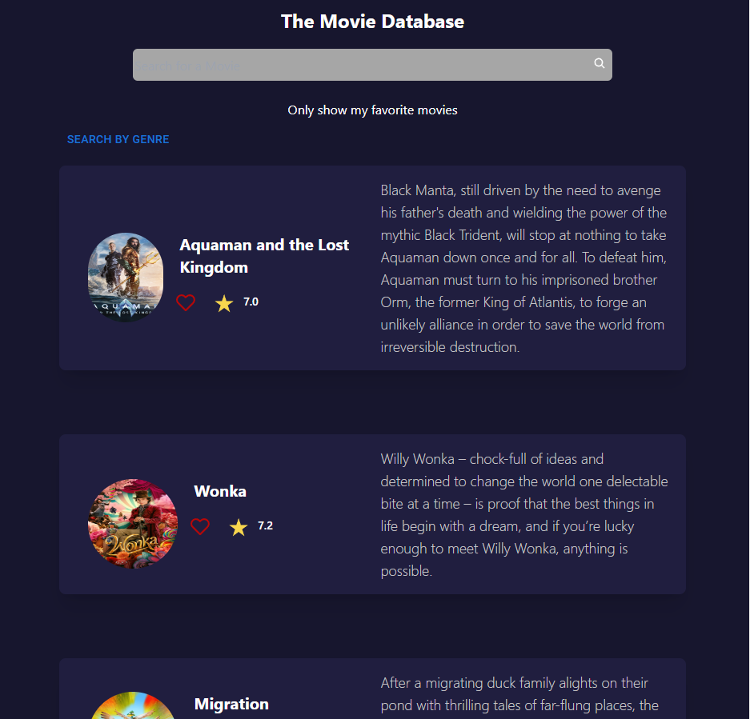
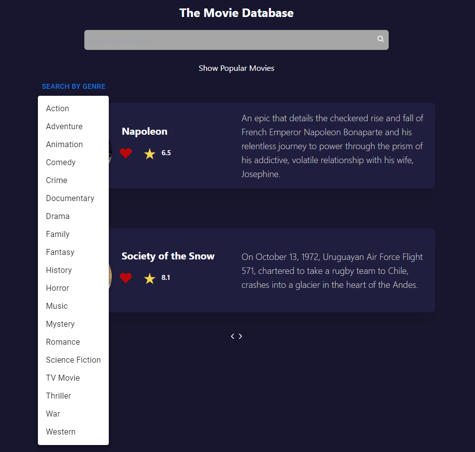

# The Movie Database 


Este repositório contém um aplicativo web para buscar e exibir informações sobre filmes utilizando a API do The Movie Database (TMDb). O aplicativo é construído com React, JavaScript, TailwindCSS e PostCSS.



## Funcionalidades

### Busca de Filmes por Título

A função `SearchTitle` permite buscar filmes por título. Ela faz uma chamada à API do TMDb utilizando a chave de API fornecida e retorna os resultados correspondentes.

Exemplo de uso:

```javascript
import { SearchTitle } from '../utils/SearchMovie';

const movieTitle = 'Nome do Filme';
const currentPage = 1;

const searchResults = await SearchTitle(movieTitle, currentPage);
console.log('Resultados da Busca:', searchResults);
```
##
### Busca de Filmes Populares
A função SearchMovie recupera os filmes populares da API do TMDb com base na página atual.

Exemplo de uso:

```javascript
import { SearchMovie } from '../utils/SearchMovie';

const currentPage = 1;

const popularMovies = await SearchMovie(currentPage);
console.log('Filmes Populares:', popularMovies);

```
##

### Busca de Filmes por Gênero
A função SearchGender permite buscar filmes com base no ID do gênero. Ela realiza uma chamada à API do TMDb e retorna os resultados correspondentes.

Exemplo de uso:

```javascript
import { SearchGender } from '../utils/SearchMovie';

const genreId = 28; // Exemplo de ID de gênero para ação
const currentPage = 1;

const actionMovies = await SearchGender(genreId, currentPage);
console.log('Filmes de Ação:', actionMovies);
```


##
### Busca de Detalhes de um Filme por ID
A função fetchMovieById recupera os detalhes de um filme com base no ID fornecido.

Exemplo de uso:
```javascript
import { fetchMovieById } from '../utils/SearchMovie';

const movieId = 123; // ID do filme desejado
const movieDetails = await fetchMovieById(movieId);
console.log('Detalhes do Filme:', movieDetails);
```
##
### Renderização de Filmes
O componente RenderMovie é utilizado para renderizar a lista de filmes. Ele aceita parâmetros como tipo de busca, título, ID de gênero, e função de redefinição de status de busca.

Exemplo de uso:

```javascript
import RenderMovie from '../modules/RenderMovie';
// ...
<RenderMovie fetchType={'name'} title={title} resetSearchStatus={() => setSearchStatus('searching')} />
```
## 
### Favoritos e Armazenamento Local
O módulo Favorites contém funções para adicionar e remover filmes dos favoritos, além de verificar se um filme está na lista de favoritos.

Exemplo de uso:

```javascript
import { getFavoritedMovies, checkFavorite, searchMovieId, saveFavoriteMovies } from '../modules/Favorites';

// ...

const movieId = 456; // ID do filme desejado
const isFavorited = checkFavorite();
getFavoritedMovies(event, movie);
//Adicionar ou remover filme dos favoritos
```
##
### Pesquisa de Filmes por Nome
O módulo searchEngine realiza a pesquisa de filmes por nome utilizando a API do TMDb.

Exemplo de uso:

```javascript
import searchEngine from '../utils/searchEngine';

const movieTitle = 'Nome do Filme';
const searchResults = await searchEngine(movieTitle);
console.log('Resultados da Pesquisa:', searchResults);
```
##
### Componente de Cabeçalho
O componente Header contém a barra de navegação e a lógica de busca. Ele permite buscar filmes por título, filtrar por favoritos e selecionar filmes por gênero.

Exemplo de uso:

```javascript
import Header from '../components/Header';

// ...

<Header />
```
Sinta-se à vontade para explorar e contribuir para este projeto! Se tiver dúvidas ou sugestões, abra uma issue ou envie um pull request.


Esse README oferece uma visão geral clara das funcionalidades do seu ap